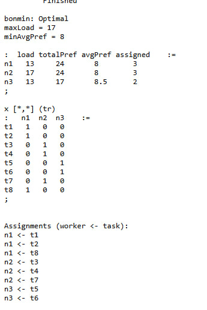

## Готовый список задач (идеальный для фазы 2 и оптимизации)

Список включает только распределяемые задачи, без командных («покер», «фильтрация фич»).  
Всего получится 8–9 задач — удобное количество для распределения между 3 людьми.

---

### Задачи, связанные с Use Case

**T1. Сформировать список из 12+ Use Case**

- собрать идеи;
- описать коротко цель каждого;
- сформировать первичный набор.

**T2. Разделить Use Cases на 3 группы и уточнить сценарии**

- выбрать 12;
- поделить на группы по сложности/семантике;
- добавить альтернативные сценарии.

**T3. Описать Use Case Group 1 (4 UC)**

- Use Case Description;
- User Stories;
- Functional slices.

**T4. Описать Use Case Group 2 (4 UC)**

- те же действия, что в T3.

**T5. Описать Use Case Group 3 (4 UC)**

- те же действия, что в T3.

---

### Задачи, связанные с оценками

**T6. Оценить проект в Cosmic Function Points**

- выделить функциональные процессы;
- определить типы data movement;
- выполнить расчёт CFP.

**T7. Оценить проект в Use Case Points**

- классифицировать UC;
- определить TCF, EF;
- рассчитать UCP и трудозатраты.

---

### 🟠 Задачи по оценке масштаба

**T8. Определить состав команды**

- роли (Dev, QA, UX, Analyst и т.д.);
- какие компетенции нужны.
---

