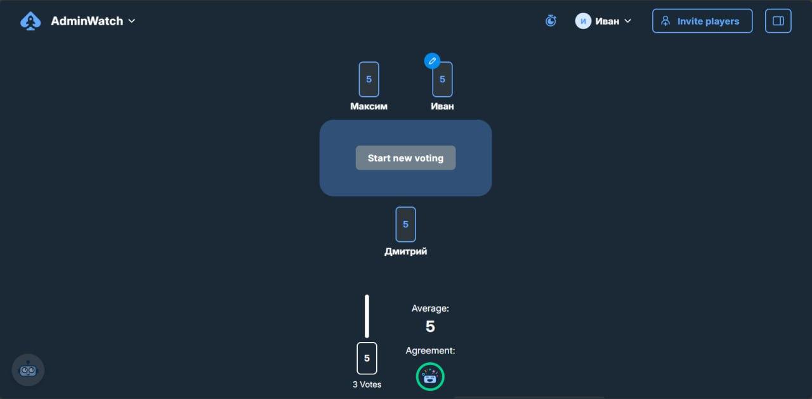

# Выводы

Проект оценивался тремя разными методами:

- **COSMIC FP = 60 CFP**  
- **UCP ≈ 96 UCP ≈ 1920 человеко-часов ≈ 12 чел.-месяцев**  
- **Planning Poker = 88 SP**

### Сводный вывод  
Система AdminWatch относится к **проектам среднего масштаба**, ближе к корпоративному уровню (enterprise-lite).  
Функциональность включает сложную обработку логов, управление ролями, интеграции, уведомления, аналитику и ML.

---

## 2. Оптимальный состав команды

На основе трудозатрат (≈1920 часов) и сложности Use Case оптимальная команда выглядит так:

| Роль | Количество | Обоснование |
|------|------------|-------------|
| **Backend Developer** | 2 | API, обработка логов, роли, интеграции |
| **Frontend Developer** | 1 | сложные таблицы, фильтры, аналитика |
| **QA Engineer** | 1 | высокая критичность качества |
| **ML/Data Engineer** | 0.5–1 | UC12: выявление аномалий |
| **DevOps** | 1 | логирование, контейнеризация, деплой |
| **System Analyst** | 1 | сценарии, матрицы ролей, спецификация событий |
| **Project Manager** | 0.5 | коммуникации, сроки |

### **Итого: 6–7 человек.**

Это команда, которая позволит развивать проект быстро и стабильно.

---

## 3. Сроки реализации

На основе UCP и SP:

### 🔹 При оптимальной команде (6–7 человек)
- **2–3 месяца** — MVP  
- **4–5 месяцев** — полная версия с аналитикой и ML  

### 🔹 При маленькой команде (3–4 человека)
- **5–7 месяцев**

---

## 4. Какие фичи можно отбросить для уменьшения сроков

Анализ SP показывает, какие Use Case дают наибольшую сложность:

| UC | SP | Причина исключения |
|----|----|---------------------|
| **UC10 — Просмотр статистики** | 13 | высокая сложность, низкая важность для MVP |
| **UC12 — ML-анализ аномалий** | 13 | отдельная ML-модель, требует данных |
| **UC9 — Экспорт логов** | 8 | полезно, но не критично |
| **UC7 — Настройки уведомлений** | 8 | можно оставить только дефолтный канал |

### 📉 Эффект сокращения  
Суммарное сокращение трудозатрат уменьшает объём почти **вдвое**, что даёт:

- Более быстрый релиз  
- Уменьшение стоимости  
- Фокус на действительно критичных функциях

---

## 5. MVP-функциональность

Для первого релиза достаточно:

- Авторизация (UC1)  
- Просмотр логов (UC2)  
- Детализация события (UC4)  
- Фильтрация и поиск (UC3, UC11)  
- Управление ролями (UC5, UC6)  

Это обеспечивает:

- просмотр событий,
- базовую безопасность,
- полезность системы с первых дней.

Уведомления (UC8) можно добавить сразу или после MVP.

---

## 6. Итоговые выводы

1. **AdminWatch — проект среднего масштаба**, требующий от 2 до 5 месяцев разработки.  
2. **Оптимальная команда — 6–7 человек.**  
3. **Основные сложности**: аналитика, ML, интеграции, безопасность.  
4. **MVP можно сделать за 2–3 месяца.**  
5. Исключение UC10, UC12, UC9 и части UC7 сокращает проект почти вдвое.  
6. Проект имеет чёткую эволюцию: *MVP → аналитика → ML*.
